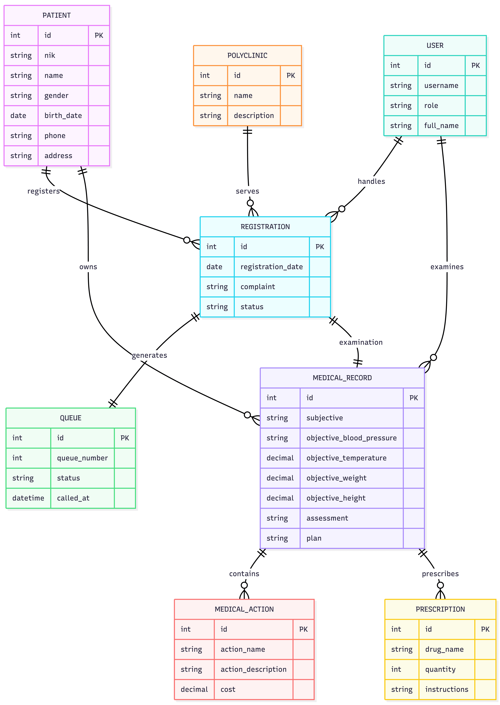

# NEXA Clinic System — Mini Clinic Information System

A full-stack mini clinic information system built as a technical take-home test.
It manages the complete patient flow: **registration → queue → medical check-up
(SOAP) → medical actions & prescriptions**, with role-based access control
(administrator, doctor, registration officer), REST API, and a relational
PostgreSQL database.



---

## Tech Stack

| Layer | Technology |
|---|---|
| **Frontend** | React 19, Vite 8, React Router 7, Axios, custom SVG icon system |
| **Backend** | Node.js, Express 5, Sequelize 6 (ORM), PostgreSQL |
| **Security** | JWT (8h expiry), bcryptjs password hashing, Helmet, CORS |
| **Validation** | Joi schemas on backend; NIK 16-digit + required-field checks on frontend |
| **Tools** | Postman collection, Git (incremental commits), ERD + Mermaid docs |

---

## Features

- **Role-based login** — one endpoint, server decides role:
  `administrator`, `dokter`, `petugas_pendaftaran`
- **Patient management** — CRUD, NIK validated as exactly 16 digits,
  medical record number auto-generated (`RM-YYYYMM-XXXX`)
- **Registration & Queue** — registration with complaint & payment type,
  queue numbers (`U001`/`G001`), statuses `menunggu → dipanggil → pemeriksaan → selesai`
- **Medical check-up (SOAP)** — Subjective, Objective (blood pressure,
  temperature, weight, height), Assessment, Plan
- **Medical actions & prescriptions** — attached to each medical record
- **Archive / soft delete** — patients are archived by default (clinical data
  never lost, per health-record retention rules); permanent delete is
  administrator-only with cascade transaction
- **Recent patients** — doctor dashboard shows last-examined patients
- **Responsive UI** — sidebar rail + drawer, works on desktop & mobile

---

## Project Structure

```
nexa-clinic-system/
├── backend/
│   ├── src/
│   │   ├── config/         # DB & env config
│   │   ├── controllers/    # route handlers
│   │   ├── middleware/     # auth, role, error handling
│   │   ├── models/         # Sequelize models (8 tables)
│   │   ├── routes/         # REST API routes
│   │   ├── seeders/        # demo data (users, patients, etc.)
│   │   ├── utils/          # API response helpers
│   │   └── validators/     # Joi validation schemas
│   ├── database/
│   │   └── schema.sql      # full PostgreSQL schema
│   ├── .env.example
│   └── package.json
├── frontend/
│   ├── src/
│   │   ├── api/            # axios client
│   │   ├── components/     # shared UI (Icon.jsx, Sidebar, ...)
│   │   ├── context/        # AuthContext
│   │   ├── pages/          # Auth, Dashboard, Patients, Registrations,
│   │   │                   # Queues, MedicalRecords, MasterData
│   │   └── utils/
│   ├── .env.example
│   └── package.json
├── docs/
│   └── ERD.png             # Entity Relationship Diagram
├── postman/                # Postman collection + environment
└── prd/                    # Product Requirements Document
```

---

## Database Schema (8 tables)

`USERS`, `PATIENTS`, `POLYCLINICS`, `REGISTRATIONS`, `QUEUES`,
`MEDICAL_RECORDS`, `MEDICAL_ACTIONS`, `PRESCRIPTIONS`

- Relationships enforced with foreign keys + `ON DELETE CASCADE`
- `registrations → queues` and `registrations → medical_records` are 1:1
  (unique FK per registration)
- Full DDL in [`backend/database/schema.sql`](backend/database/schema.sql)

---

## Getting Started

### Prerequisites

- Node.js ≥ 18
- PostgreSQL ≥ 14 (local, or Docker container)
- npm

### 1. Database

```bash
# Option A — run schema directly
psql -U postgres -c "CREATE DATABASE clinic_system;"
psql -U postgres -d clinic_system -f backend/database/schema.sql

# Option B — Docker
docker run -d --name nexa-postgres -p 5432:5432 \
  -e POSTGRES_DB=clinic_system -e POSTGRES_USER=postgres \
  -e POSTGRES_PASSWORD=your_password postgres:16
```

### 2. Backend

```bash
cd backend
cp .env.example .env        # then edit DB_PASSWORD + JWT_SECRET
npm install
npm run sync:force          # creates tables + seeds demo data
npm run dev                 # http://localhost:5000
```

### 3. Frontend

```bash
cd frontend
cp .env.example .env        # VITE_API_URL=http://localhost:5000/api
npm install
npm run dev                 # http://localhost:5174
```

Open **http://localhost:5174** in your browser.

---

## Demo Accounts

| Role | Username |
|---|---|
| Administrator | `admin` |
| Doctor | `dr.sari`, `dr.budi` |
| Registration officer | `petugas1` |

All demo accounts share the same demo password (see `backend/src/seeders/seed.js`).
The login page also provides click-to-fill demo account cards.

---

## REST API Overview

Base URL: `http://localhost:5000/api`

| Method | Endpoint | Description | Access |
|---|---|---|---|
| POST | `/auth/login` | Login, returns JWT | Public |
| POST | `/auth/logout` | Logout | Authenticated |
| GET | `/auth/me` | Current user profile | Authenticated |
| GET | `/dashboard` | Dashboard stats | Authenticated |
| GET | `/referensi/doctors` | Doctor list | Authenticated |
| GET | `/referensi/polyclinics` | Polyclinic list | Authenticated |
| GET | `/patients` | List patients (paginated) | Authenticated |
| GET | `/patients/:id` | Patient detail | Authenticated |
| GET | `/patients/:id/related-counts` | Related records count | Authenticated |
| POST | `/patients` | Create patient | admin / officer |
| PUT | `/patients/:id` | Update patient | admin / officer |
| DELETE | `/patients/:id` | Archive patient (soft delete) | Administrator |
| DELETE | `/patients/:id/permanent` | Permanently delete (cascade) | Administrator |
| GET | `/registrations` | List registrations | Authenticated |
| POST | `/registrations` | Create registration | admin / officer |
| PUT | `/registrations/:id` | Update registration | admin / officer |
| GET | `/queues` | List queues | Authenticated |
| PUT | `/queues/:id/call` | Call next patient | Authenticated |
| PUT | `/queues/:id/status` | Update queue status | Authenticated |
| GET | `/medical-records/recent-patients` | Recently examined patients | Authenticated |
| GET | `/medical-records/:id` | Medical record detail | Authenticated |
| GET | `/medical-records/patient/:patientId` | Patient history | Authenticated |
| POST | `/medical-records` | Create SOAP record | Doctor |
| POST | `/medical-records/:id/prescriptions` | Add prescription | Doctor |
| GET | `/medical-records/prescriptions/:id` | Prescription detail | Authenticated |

All protected endpoints require header: `Authorization: Bearer <token>`.

---

## API Documentation (Postman)

A ready-to-import collection is provided in [`postman/`](postman/):

- `NEXA Clinic System API.postman_collection.json` — 23 requests across
  7 folders, with auto-token script (login sets `token` in environment
  and collection variables)
- Environment: `baseUrl = http://localhost:5000/api`

Import both files in Postman → set active environment → run **Login** →
`token` is populated automatically → all other requests work.

---

## Verification

- Frontend: `npm run lint` (oxlint) — 0 errors; `npm run build` passes
- Backend: server starts, health check `GET /api/health` → `{"success": true}`
- E2E: login → dashboard → patient registration → queue → SOAP examination
  verified in browser with Playwright

---

## License

ISC — for evaluation purposes.
