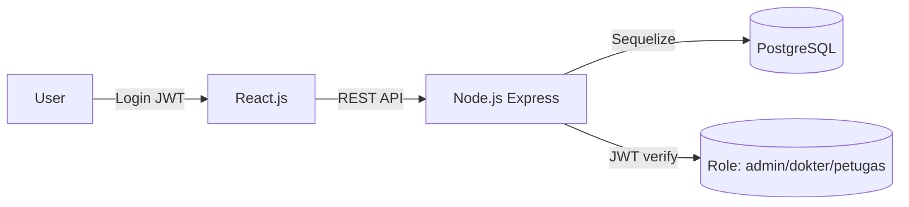

# PRD: Mini Clinic Information System (NEXA)

**Status:** Draft
**Versi:** 1.0
**Tanggal:** 2026-07-31
**Author:** Hermes AI (atas permintaan user)
**Referensi Utama:** `TECHNICAL ASSIGNMENT PROGRAMMER NEXA.pdf` (Take Home Test)

---

## 1. Executive Summary

Mini Clinic Information System adalah aplikasi web untuk klinik pratama yang menggantikan proses
manual (antrean tidak teratur, pencatatan data pasien tersebar, riwayat pemeriksaan sulit dilacak).
Aplikasi mencakup pengelolaan data pasien, pendaftaran kunjungan, pengelolaan antrean, dan
pencatatan pemeriksaan dokter dengan metode SOAP. Sistem dibangun dengan React.js (frontend),
Node.js Express (backend), PostgreSQL (database), dan JWT (autentikasi) sesuai ketentuan technical
assignment NEXA.

---

## 2. Problem Statement

- **Masalah:** Klinik pratama melakukan sebagian besar proses pelayanan secara manual → antrean
  tidak teratur, data pasien tersebar, kesulitan melihat riwayat pemeriksaan pasien.
- **Dampak:** Kualitas pelayanan menurun, administrasi lambat, riwayat medis pasien tidak
  terintegrasi.
- **Solusi:** Aplikasi web terintegrasi yang mencakup proses utama pelayanan klinik:
  pasien → pendaftaran → antrean → pemeriksaan dokter → riwayat.

---

## 3. Target Users & Personas

| Persona | Role | Need Utama |
|---------|------|------------|
| Administrator | `administrator` | Kontrol penuh: kelola semua data, master data, monitoring |
| Dokter | `dokter` | Melihat antrean, melakukan pemeriksaan SOAP, input tindakan & resep, melihat riwayat |
| Petugas Pendaftaran | `petugas_pendaftaran` | Daftarkan pasien, kelola data pasien, kelola antrean |

**User Stories:**
- Sebagai petugas pendaftaran, saya ingin mendaftarkan pasien dan memilih dokter/poli sehingga
  pasien otomatis mendapat nomor antrean.
- Sebagai dokter, saya ingin memanggil antrean dan mengisi pemeriksaan SOAP sehingga hasil
  pemeriksaan tercatat dan pasien ditandai selesai.
- Sebagai administrator, saya ingin melihat dashboard sehingga mengetahui total pasien dan
  status antrean hari ini.

---

## 4. Functional Requirements

### MVP (Wajib — dari PDF)

#### Modul A: Authentication (PDF D.1)
| ID | Fitur | Deskripsi | Prioritas |
|----|-------|-----------|-----------|
| FR-001 | Login | Autentikasi user dengan JWT | P0 |
| FR-002 | Logout | Menghapus sesi/token | P0 |
| FR-003 | Role-based Authorization | 3 role: `administrator`, `dokter`, `petugas_pendaftaran`; akses halaman/API dibatasi per role | P0 |

#### Modul B: Master Data Pasien (PDF D.2)
| ID | Fitur | Deskripsi | Prioritas |
|----|-------|-----------|-----------|
| FR-004 | Tambah Pasien | No. Rekam Medis **auto-generate**, NIK, nama, gender, tgl lahir, telepon, alamat | P0 |
| FR-005 | Ubah Pasien | Update data pasien | P0 |
| FR-006 | Hapus Pasien | Hapus data pasien | P0 |
| FR-007 | Detail Pasien | Lihat detail lengkap pasien | P0 |
| FR-008 | Pencarian Pasien | Search by NIK, nama, no. RM, telepon | P0 |
| FR-009 | Pagination | Daftar pasien ter-pagination | P0 |
| FR-010 | Validasi NIK | NIK tidak boleh duplikat (16 digit numerik) | P0 |

#### Modul C: Pendaftaran Pasien (PDF D.3)
| ID | Fitur | Deskripsi | Prioritas |
|----|-------|-----------|-----------|
| FR-011 | Daftar Kunjungan | Data: pasien, dokter, poli, tanggal kunjungan, jenis pembayaran (umum/bpjs/asuransi), keluhan awal | P0 |
| FR-012 | Status Kunjungan | Status: `menunggu` → `check_up` → `pemeriksaan` → `selesai` | P0 |

#### Modul D: Antrean (PDF D.4)
| ID | Fitur | Deskripsi | Prioritas |
|----|-------|-----------|-----------|
| FR-013 | Generate Nomor Antrean | Otomatis, format contoh `A001`, `A002`, `A003` (prefix inisial poli + 3 digit) | P0 |
| FR-014 | Daftar Antrean | Menampilkan daftar antrean lengkap dengan info pasien/dokter/poli | P0 |
| FR-015 | Panggil Antrean | Memanggil antrean berikutnya (status → dipanggil) | P0 |
| FR-016 | Ubah Status Antrean | Menunggu / dipanggil / pemeriksaan / selesai / lewat | P0 |
| FR-017 | Sinkronisasi Status | Status antrean sinkron dengan status registrasi | P1 |

#### Modul E: Pemeriksaan Dokter — SOAP (PDF D.5)
| ID | Fitur | Deskripsi | Prioritas |
|----|-------|-----------|-----------|
| FR-018 | Subjective | Keluhan pasien | P0 |
| FR-019 | Objective | Tekanan darah, suhu tubuh, berat badan, tinggi badan | P0 |
| FR-020 | Assessment | Diagnosa | P0 |
| FR-021 | Plan | Rencana terapi | P0 |
| FR-022 | Input Tindakan Medis | Nama tindakan, deskripsi, biaya | P0 |
| FR-023 | Input Resep Obat | Nama obat, dosis, quantity, instruksi | P0 |
| FR-024 | Riwayat Pemeriksaan Pasien | Riwayat lengkap per pasien (SOAP + tindakan + resep) | P0 |

#### Modul F: Dashboard (PDF D.6)
| ID | Fitur | Deskripsi | Prioritas |
|----|-------|-----------|-----------|
| FR-025 | Total Pasien | Jumlah seluruh pasien terdaftar | P0 |
| FR-026 | Total Pasien Hari Ini | Jumlah registrasi hari ini | P0 |
| FR-027 | Total Antrean Hari Ini | Jumlah antrean aktif hari ini | P0 |
| FR-028 | Total Pasien Menunggu | Jumlah antrean status menunggu | P0 |
| FR-029 | Total Pasien Selesai | Jumlah antrean status selesai | P0 |

### API Endpoints Minimum (PDF E — REST API)
| ID | Endpoint | Deskripsi |
|----|----------|-----------|
| API-001 | `POST /login` | Login JWT |
| API-002 | `POST /logout` | Logout |
| API-003 | `GET /patients` | List pasien (search + pagination) |
| API-004 | `GET /patients/{id}` | Detail pasien |
| API-005 | `POST /patients` | Tambah pasien |
| API-006 | `PUT /patients/{id}` | Ubah pasien |
| API-007 | `DELETE /patients/{id}` | Hapus pasien |
| API-008 | `GET /registrations` | List pendaftaran |
| API-009 | `POST /registrations` | Buat pendaftaran (+ auto queue) |
| API-010 | `PUT /registrations/{id}` | Ubah pendaftaran |
| API-011 | `GET /queues` | List antrean |
| API-012 | `POST /queues` | Buat antrean |
| API-013 | `PUT /queues/{id}/call` | Panggil antrean |
| API-014 | `PUT /queues/{id}/status` | Ubah status antrean |
| API-015 | `POST /medical-records` | Buat rekam medis (SOAP + tindakan + resep) |
| API-016 | `GET /medical-records/{patientId}` | Riwayat rekam medis per pasien |
| API-017 | `POST /prescriptions` | Buat resep |
| API-018 | `GET /prescriptions/{id}` | Detail resep |

### Standar Response API (PDF E)
- **Success:** `{ "success": true, "message": "Success", "data": {...} }`
- **Error:** `{ "success": false, "message": "Validation Error", "errors": {...} }`

### Post-MVP (Nice to Have)
| ID | Fitur | Deskripsi | Prioritas |
|----|-------|-----------|-----------|
| FR-030 | Master Data Poli & Dokter | CRUD poli, CRUD user/dokter via UI admin | P1 |
| FR-031 | Laporan | Rekap kunjungan per periode | P2 |
| FR-032 | Cetak Resep / Surat | Print-out resep dan surat keterangan | P2 |

---

## 5. Non-Functional Requirements

- **Performance:** Load halaman < 2 detik; API response < 500ms pada data normal.
- **Security:**
  - Password di-hash (bcrypt).
  - JWT dengan expiry; role authorization di backend (bukan hanya UI).
  - Konfigurasi sensitif (DB, JWT Secret) di `.env`, **tidak boleh hardcode** (PDF G.6).
- **Reliability:** Error handling konsisten; 404 handler; validasi frontend & backend (PDF F).
- **Architecture:** Struktur terstruktur & mudah dikembangkan (PDF F) — MVC pattern di backend.
- **Clean Code:** Naming konsisten, folder terorganisir (controllers, models, routes, validators, utils).

---

## 6. Tech Stack

| Layer | Teknologi | Alasan |
|-------|-----------|--------|
| Frontend | React.js (Vite) | Wajib dari PDF |
| Backend | Node.js + Express.js | Wajib dari PDF |
| Database | PostgreSQL (Sequelize ORM) | Wajib dari PDF (opsi PostgreSQL/MySQL) |
| Authentication | JWT (jsonwebtoken) | Wajib dari PDF |
| Validation | Joi | Validasi backend yang robust |
| Version Control | Git (GitHub) | Wajib dari PDF, commit history dinilai |

---

## 7. UI/UX Guidelines

- **Style:** Dark theme, clean, konsisten antar halaman (PDF H Catatan: rapi, mudah digunakan, konsisten).
- **Komponen:** Custom CSS (tanpa framework UI), komponen reusable (badge, button, modal, table).
- **Layout:** Sidebar navigasi + main content; responsive (sidebar collapse di mobile).
- **Halaman:**
  - Login (username + password)
  - Dashboard (5 stat cards)
  - Data Pasien (tabel + search + pagination + modal form)
  - Pendaftaran (modal form + patient search + dropdown dokter/poli)
  - Antrean (kanban board 4 kolom: menunggu → dipanggil → pemeriksaan → selesai)
  - Pemeriksaan (form SOAP + dynamic list tindakan & resep)
  - Riwayat (search pasien → history cards)

---

## 8. Architecture & Data Flow

**Alur bisnis:**
1. Petugas mendaftarkan pasien (pilih pasien, dokter, poli, pembayaran, keluhan)
2. Sistem auto-generate nomor antrean (prefix inisial poli + nomor urut, mis. `U001`, `G001`)
3. Antrean muncul di board; petugas panggil → dokter mulai pemeriksaan
4. Dokter mengisi SOAP + tindakan medis + resep → simpan
5. Status otomatis menjadi `selesai`; riwayat tersimpan di rekam medis pasien

---

## 9. Milestones

| Fase | Target | Deliverable |
|------|--------|-------------|
| M1 - Setup & DB | ✅ Selesai | Repo, scaffolding, ERD, schema.sql, models |
| M2 - Backend API | ✅ Selesai | Semua endpoint (auth, patients, registrations, queues, medical-records, dashboard) |
| M3 - Frontend Demo | ✅ Selesai (menunggu approval final) | Semua halaman dengan mock data, flow sesuai PDF |
| M4 - Integrasi | TBD | Frontend connect ke backend real (PostgreSQL) |
| M5 - Finalisasi | TBD | README, Postman Collection, .env.example, video demo, push final |

---

## 10. Success Metrics

- **Fungsional:** 100% FR P0 (FR-001 s.d. FR-029) berfungsi sesuai PDF.
- **API:** Semua 18 endpoint minimum berjalan dengan standar response konsisten.
- **Teknis:** Commit history menunjukkan proses pengembangan bertahap (PDF G.8 — hindari 1 commit akhir).
- **Deliverables:** 9 item deliverables PDF (G) lengkap: source code FE, source code BE, file .sql, ERD, Postman Collection, README, .env.example, repo GitHub, video demo ≤ 10 menit.

---

## 11. Traceability Matrix (Mapping ke PDF)

| PDF Section | Requirement | Status Implementasi |
|-------------|-------------|---------------------|
| A. Informasi Umum | Posisi Programmer, estimasi 3 hari | ✅ |
| C. Teknologi | React, Express, PostgreSQL/MySQL, JWT, Git | ✅ |
| D.1 Authentication | Login, Logout, Role Authorization | ✅ FR-001..003 |
| D.2 Master Data Pasien | Auto RM#, CRUD, search, pagination, NIK unik | ✅ FR-004..010 |
| D.3 Pendaftaran | Pasien, dokter, poli, tgl, pembayaran, keluhan, status | ✅ FR-011..012 |
| D.4 Antrean | Auto nomor, list, panggil, ubah status | ✅ FR-013..017 |
| D.5 Pemeriksaan SOAP | S/O/A/P, tindakan medis, resep, riwayat | ✅ FR-018..024 |
| D.6 Dashboard | 5 total indikator | ✅ FR-025..029 |
| E. REST API | 18 endpoint minimum + standar response | ✅ |
| F. Ketentuan | Arsitektur terstruktur, validasi FE+BE, error handling, Git | ✅ |
| G. Deliverables | 9 item (README, .env.example, Postman, video, dsb.) | ⏳ M5 |
| H. Kriteria Penilaian | 8 aspek dengan bobot (total 100%) | ⏳ Review final |

---

## Log

| Tanggal | Perubahan | Oleh |
|---------|-----------|------|
| 2026-07-31 | Dokumen awal (berdasarkan PDF + hasil review flow frontend) | Hermes AI |
